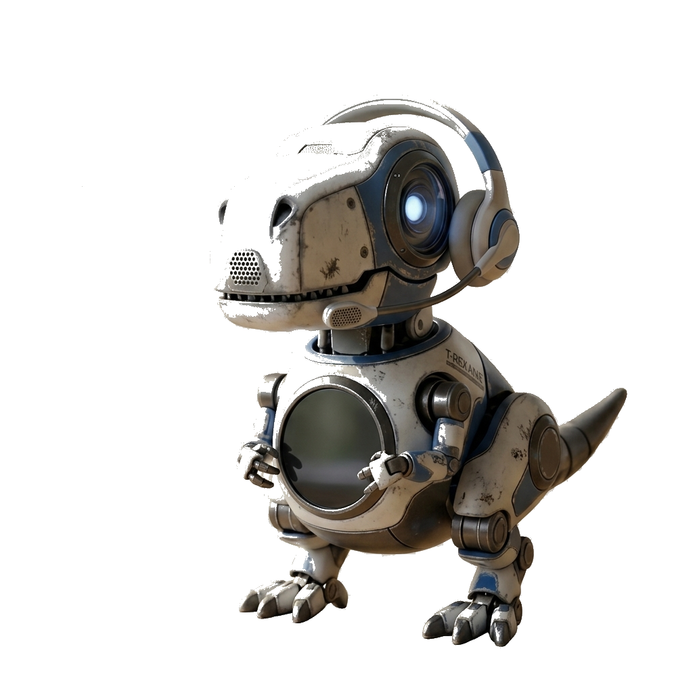

# 🦖 Study Rex AI — Intelligent AI Study Companion & Workstation

<p align="center">
  
</p>

<p align="center">
  <b>A comprehensive, interactive AI study workstation designed to transform static lecture notes, textbooks, and PDFs into interactive Q&A sessions, 3D flashcards, summaries, and spaced-repetition quizzes.</b>
</p>

<p align="center">
  
  
  
  
  
</p>

---

## 📸 Interface & Visual Gallery

All high-resolution application screenshots are stored locally in [`screenshots/`](./screenshots).

### 1. 🏠 Home & Welcome Hub
Overview of study tools, AI model capabilities, and quick workstation launching.


---

### 2. 📊 Dashboard Metrics & Performance
Real-time tracking of study goals, weekly performance graph, streaks, and quick tool drawers.


---

### 3. 🤖 Rex Study Hub (Interactive AI Assistant)
Context-aware interactive Q&A assistant powered dynamically by Google Gemini and Groq models.


---

### 4. 📚 Material Ingestion Library
Seamless document ingestion supporting `.pdf` and `.txt` files with text extraction and caching.


---

### 5. 🗂️ 3D Flashcard Decks & Spaced Repetition
Interactive 3D flip card decks with confidence ratings (Easy / Good / Hard) for optimal memory retention.


---

### 6. 📝 Interactive Practice Quizzes
Dynamic multiple-choice quizzes with instant evaluation, feedback, and score analysis.


---

### 7. ⏱️ Study Notes & Task Workstation
Integrated study notes, Pomodoro focus timer (25 min intervals), and task progress tracking.


---

## ⚡ Key Features

- **Multi-Engine AI Integration**: Seamlessly switches between **Google Gemini (3.6 Flash)** and **Groq (LLaMA 3.3 70B)** with intelligent fallback handling.
- **Document Processing**: Fast client & server PDF/TXT extraction using `pypdf`, persistent material caching, and local context generation.
- **Spaced Repetition & Flashcards**: Active recall study decks with custom subject filtering (Computer Science, Chemistry, Mathematics, AI/ML).
- **Integrated Focus Tools**: Built-in Pomodoro focus timer, daily check-in streaks, study tips, and goal checklists with `localStorage` persistence.
- **Sophisticated Design System**: Modern dark theme with curated olive & vibrant lime accents (`#86C232`), glassmorphism card containers, and responsive micro-animations.

---

## 🛠️ Tech Stack

- **Backend**: Python 3.13+, Flask
- **AI / LLMs**: Google Gemini API (`gemini-3.6-flash`), Groq API (`llama-3.3-70b-versatile`), OpenAI Client SDK
- **Document Parsing**: `pypdf`
- **Frontend**: HTML5, Vanilla JavaScript, Tailwind CSS, Chart.js, Marked.js, FontAwesome

---

## 🚀 Quick Start Guide

### 1. Clone the Repository
```bash
git clone https://github.com/nishgitt/Rex-Assistant.git
cd Rex-Assistant
```

### 2. Create and Activate Virtual Environment
```bash
python -m venv .venv

# On Windows PowerShell:
.\.venv\Scripts\Activate.ps1

# On Linux / macOS:
source .venv/bin/activate
```

### 3. Install Dependencies
```bash
pip install -r requirements.txt
```

### 4. Configure Environment Variables
Create a `.env` file in the project root:
```env
# Google Gemini API Key (Recommended)
GEMINI_API_KEY=your_gemini_api_key_here

# Groq API Key (Alternative / Fallback)
GROQ_API_KEY=your_groq_api_key_here
```

### 5. Run the Application
```bash
python app.py
```
Open your browser and navigate to: **`http://127.0.0.1:5000`**

---

## 📂 Project Structure

```
Rex-Assistant/
├── .venv/                     # Python virtual environment
├── static/                    # Static assets & avatar images
│   ├── rex_avatar.png
│   └── rex_bot.png
├── templates/
│   └── index.html             # Single-page dashboard application
├── uploads/                   # Cached extracted text & study materials
├── screenshots/               # High-resolution screenshots of all views
│   ├── 01_home.png
│   ├── 02_dashboard.png
│   ├── 03_study_hub.png
│   ├── 04_material_library.png
│   ├── 05_flashcard_decks.png
│   ├── 06_practice_quizzes.png
│   └── 07_notes_and_planner.png
├── .env                       # Environment credentials (git-ignored)
├── .gitignore
├── app.py                     # Flask server & AI API routing
├── requirements.txt           # Project dependencies
└── README.md                  # Project documentation & visual guide
```

---

## 👤 Author
**Nishanth** — [@nishgitt](https://github.com/nishgitt)
