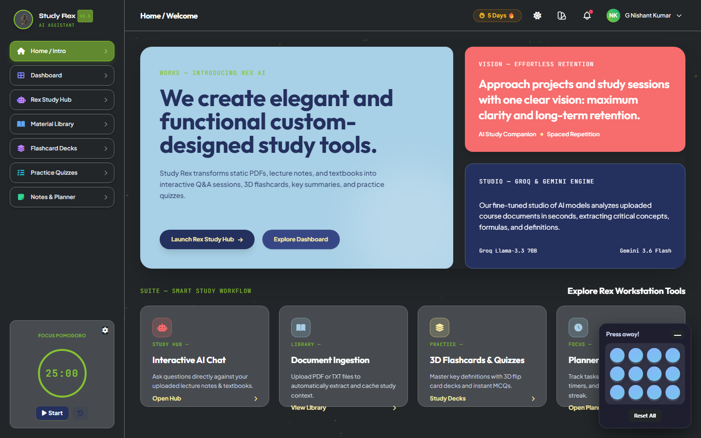
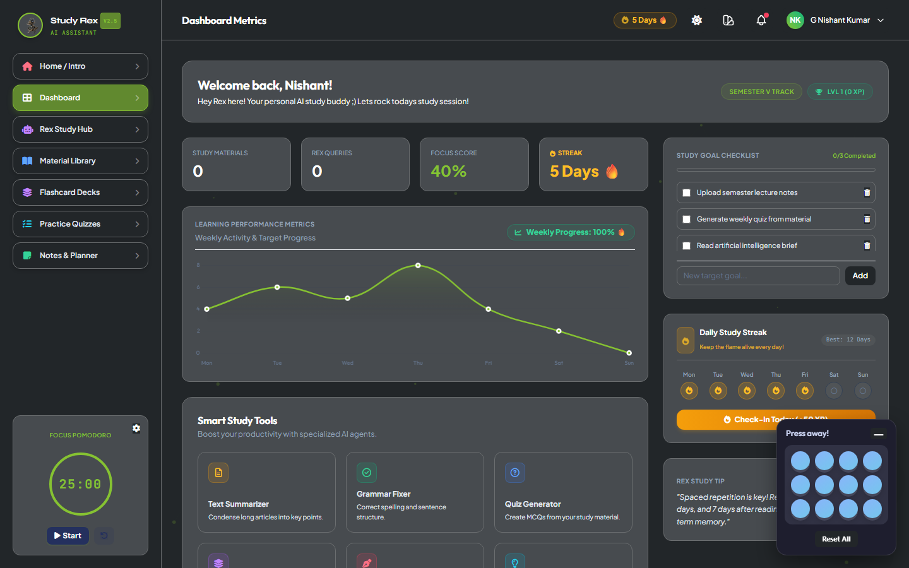
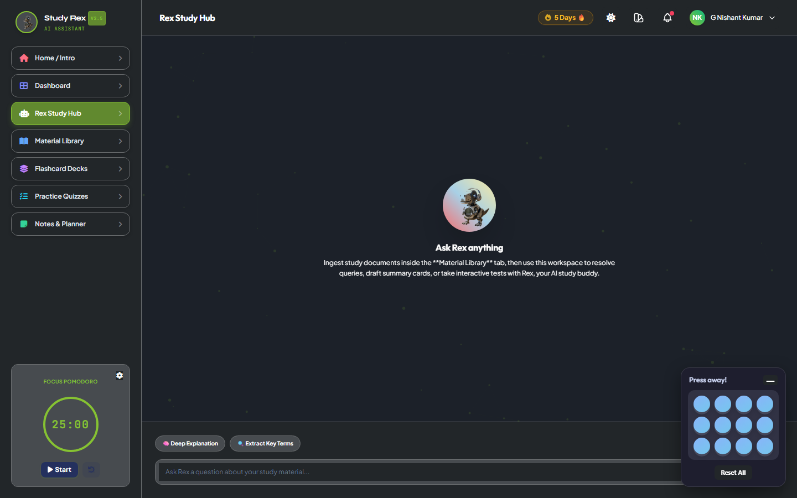
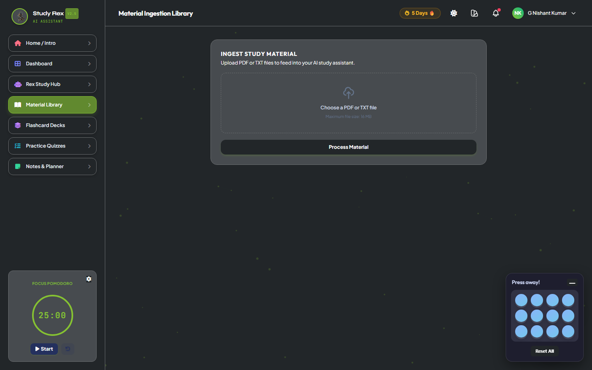
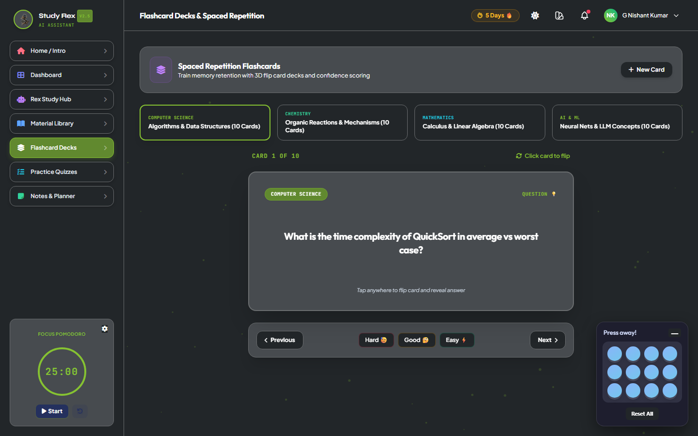
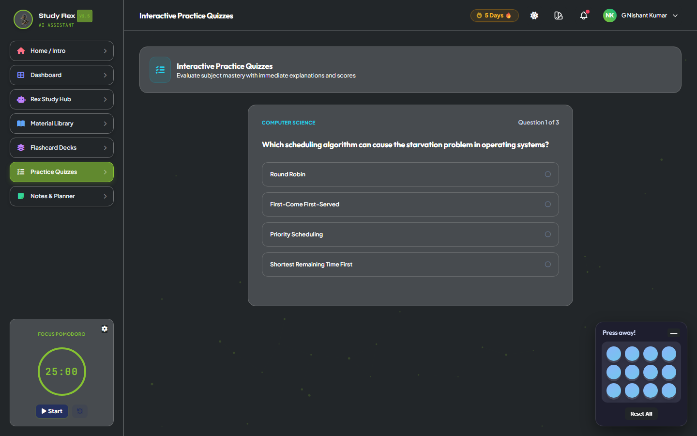
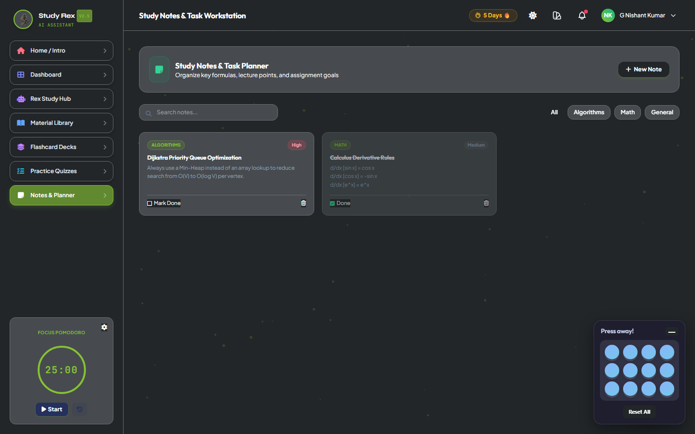

# 📸 Rex AI — Application Screenshots Gallery

This document contains high-resolution preview screenshots of every major workspace and view inside the **Rex AI Assistant** dashboard.

---

### 1. Home / Welcome Overview
> Introduces the Rex AI platform, capabilities, and workstation suite.

---

### 2. Dashboard Metrics & Study Analytics
> Displays active streak, focus score, learning performance graph, daily checklist, and quick smart study tools.

---

### 3. Rex Study Hub (Interactive AI Assistant)
> Interactive conversational AI assistant capable of in-depth context exploration from uploaded lecture documents.

---

### 4. Material Ingestion Library
> Workspace for ingesting and processing `.pdf` and `.txt` study materials with automated text extraction.

---

### 5. Flashcard Decks & Spaced Repetition
> Interactive 3D flip card decks with confidence ratings and categorization across multiple subjects.

---

### 6. Practice Quizzes
> Multiple-choice practice questions with instant evaluation, scoring, and explanation breakdowns.

---

### 7. Notes & Planner Workstation
> Integrated study note-taking environment, task management, and Pomodoro focus timer.

